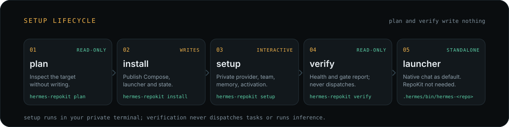

<p align="center">
  
</p>

<p align="center">
  
  
  
  
</p>

**Hermes RepoKit** turns a repository into a self-contained Hermes development
environment: one Docker container, six coordinated native profiles, a shared
Kanban board and embedded OpenViking memory. It generates ordinary Docker Compose,
private `.hermes` state and a standalone `hermes-<repo>` launcher — then steps out
of the way. The installed runtime does not need RepoKit.

> **Status · pre-v1.** The six-role team, shared memory and gateway activation are
> implemented and tested offline. Full integration acceptance is not complete:
> live model work, memory recall and independent same-card review remain
> unqualified. See [Evidence and remaining gates](#evidence-and-remaining-gates).

## Quickstart

End-user binaries need Docker Compose, Git and a POSIX shell — no host Go, Python,
Node or Hermes. Run from the repository you want a team for.

```sh
cd my-project
hermes-repokit plan      # inspect the target; writes nothing
hermes-repokit install   # publish Compose, launcher and private state
# Run the printed Compose build/start command.
hermes-repokit setup     # private provider, team, memory and activation
hermes-repokit verify    # read-only health and gate report
.hermes/bin/hermes-my-project
```

<p align="center">
  
</p>

`install` prints the exact Compose build/start command for your Docker context.
`setup` runs in your private terminal and never captures credentials; `--team`
resumes reconciliation without repeating provider login, and `--memory` resumes
memory setup. Existing owner edits, profiles and memories are preserved, and no
PATH link or shell change is automatic. See the [setup and recovery guide](docs/bootstrap-quickstart.md).

## Usage

Talk to `default`; it answers lightweight work directly and delegates substantive
changes across the team. The standalone launcher opens native chat as `default`
with no arguments and forwards explicit native arguments unchanged:

```sh
.hermes/bin/hermes-my-project                 # native chat as default
.hermes/bin/hermes-my-project profile list
.hermes/bin/hermes-my-project kanban list
.hermes/bin/hermes-my-project plugins list
```

Resume an interrupted setup with `setup --team` or `setup --memory`. After
bootstrap, ordinary Docker Compose owns the runtime; use the Docker context
captured in the launcher and the commands in the
[setup and recovery guide](docs/bootstrap-quickstart.md#ordinary-runtime-management).

## The team

Talk to `default`. It handles lightweight work directly and delegates substantive
changes across the permanent roster.

| Profile | Responsibility |
| --- | --- |
| `default` | User-facing assistant, coordinator and decision owner |
| `researcher` | Resolve unknowns and gather evidence |
| `planner` | Define a bounded execution contract |
| `executor` | Produce the requested artifact or change |
| `reviewer` | Independently verify against the contract |
| `steward` | Maintain profile identities and the team lifecycle |

Steward prefers a task-scoped skill before creating a persistent specialist.
Retirement preserves history; deletion needs explicit approval. See the
[team model and boundaries](docs/team-model.md).

## What it leaves behind

<p align="center">
  
</p>

RepoKit writes a private `my-project/.hermes/` directory and one Compose-owned
Hermes container. It is only a bootstrapper: after install, ordinary Docker
Compose and the native launcher own the deployment.

The directory holds `compose.yaml`, the standalone `bin/hermes-my-project`
launcher, `config.yaml`, the pinned `development-image/`, private `openviking/`
memory data and a `.gitignore` that ignores all native state.

The container mounts the repository at `/workspace`, native state at `/opt/data`
and memory data at `/app/.openviking`. Official OpenViking runs inside Hermes
under the native s6 supervisor on loopback, with no published host port; provider
credentials stay in native private setup. OpenViking can synchronize turns and
tool results and extract memory automatically — the owner's embedding and
extraction model choices decide where that data is processed.

The generated development image carries pinned tools and adds Go when the root
`go.mod` requires it. Optional `install --docker-tests` adds an isolated,
privileged test daemon behind an opt-in Compose profile, without mounting the host
Docker socket. See [development runtime qualification](docs/qualification/development-runtime.md).

## Existing deployments

Older generated Laya stacks are not automatic upgrade candidates: current install
fails closed and preserves their state. Migrating to the core deployment requires
an owner-coordinated backup and teardown with the original tools, followed by a
fresh installation. Do not hand-patch generated Compose or private state, and note
that owner-installed plugins and private data are not removed automatically. This
source change has not altered any live deployment. See
[migration limits](docs/bootstrap-quickstart.md#legacy-deployment-migration).

## How it runs

Fresh installs keep automatic dispatch off. Successful setup requires native
profile, provider and tool readiness plus authenticated shared memory before it
enables one `default` gateway dispatcher with automatic review, concurrency one
and no automatic decomposition. Operational readiness also requires a real
no-write researcher canary. Live Telegram delivery and independent same-card
review remain pending.

## Evidence and remaining gates

`verify` observes artifacts, native configuration, runtime metadata and bounded
health responses; it does not run models, dispatch tasks or write memory. Memory
`active` means the six bindings authenticate as the repository user — it does not
prove extraction or recall. Same-card review is `unqualified`, so a healthy
scaffold can still produce a nonzero exit status.

Credential-free foundation fixtures previously demonstrated native profiles,
Kanban persistence and launcher/Compose operation after removing a copied
installer. Those observations do not qualify the current embedded-memory image or
real model-driven work. See [historical runtime observations](docs/qualification/runtime-observations.md)
and [current implementation status](docs/implementation-progress.md).

| Area | Remaining evidence |
| --- | --- |
| Embedded memory | Live write/recall, restart persistence and cross-repository denial |
| Team work | Real executor/reviewer correction cycle and originating-channel delivery |
| Runtime independence | Full integrated removal-first acceptance with real work and memory |
| Optional plugins | Native scanner admission and owner-selected configuration |

The recorded Superpowers candidate was refused with 229 CAUTION findings; its
[scanner report](docs/qualification/superpowers-8ca22dba-scan.txt) remains an
explicit admission gate for that candidate. Optional plugins are owner-managed.

## Agent skill

[skill-hermes-repokit](skills/skill-hermes-repokit/SKILL.md) teaches an agent to
install, resume, verify and use RepoKit in a target repository. Copy the folder
into your agent's skills directory — `~/.agents/skills/` for Codex, Pi and
OpenCode, or `~/.claude/skills/` for Claude Code — preserving any existing skill of
the same name. The folder follows the portable [Agent Skills](https://agentskills.io/)
layout, and installing it does not start a deployment.

## Development

Go module: `github.com/TrebuchetDynamics/hermes-repokit`; Go 1.26 or newer. Host
builds target Linux amd64 and arm64; the generated development image targets Linux
amd64. End-user binaries need Docker Compose, Git and a POSIX shell.

```sh
go test ./...
go test -race ./...
go vet ./...
gofmt -l cmd internal tests
```

Ordinary tests are offline. Docker acceptance creates and removes disposable
projects only with explicit opt-in:

```sh
REPOKIT_DOCKER_TESTS=1 go test -tags=docker ./tests/acceptance -run TestDockerFoundation -v
REPOKIT_DOCKER_TESTS=1 go test -tags=docker ./tests/acceptance -run TestDockerOpenVikingPending -v
```

The full offline and race suites, including the Unix-socket fixtures, pass.
Live Docker and model acceptance remain unqualified. See the
[design](docs/superpowers/specs/2026-09-27-repokit-bootstrap-design.md),
[plan](docs/superpowers/plans/2026-09-27-repokit-bootstrap.md), and
[remaining work](TODO.md).
