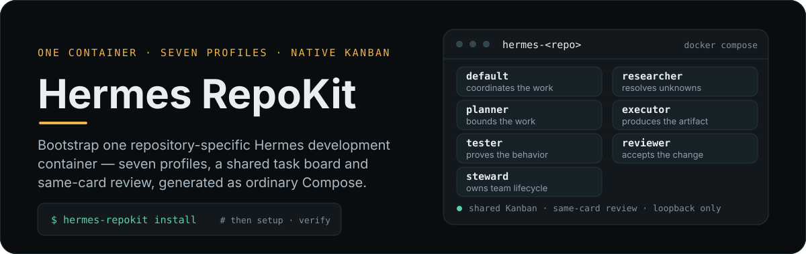
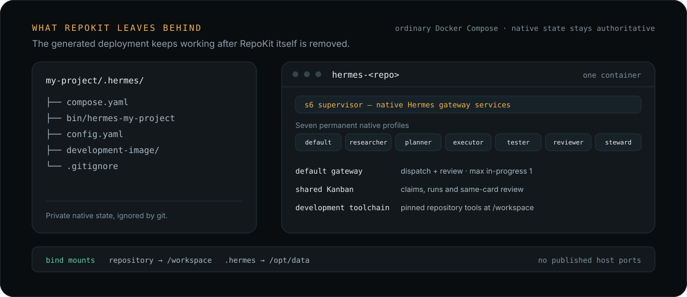

<p align="center">
  
</p>

<p align="center">
  
  
  
</p>

# A dedicated Hermes team for every repository

**RepoKit prepares the environment. Hermes runs Hermes.** RepoKit is a small,
per-repository bootstrapper: it gives a project its own persistent Hermes
workspace and team, then gets out of the way. Hermes remains the agent runtime
and owns profiles, conversations, channels and Kanban; RepoKit configures and
launches that environment rather than replacing Hermes with another agent
framework.

The goal is simple: give every project a ready-to-use team without hand-building
container glue, mixing project state, or taking over the application's existing
Docker Compose stack. The generated launcher and ordinary Compose control the
environment after setup; RepoKit does not need to stay running.

> **Pre-v1.** Linux amd64 is the documented end-to-end host target. Linux arm64
> is a RepoKit CLI build target, but the current development image is pinned to
> linux/amd64; macOS and ARM Linux are not qualified deployment hosts. See
> [status and limits](#status-and-limits) and the linked qualification records.

## Why RepoKit

- **A workspace per project:** each repository gets its own Compose project and
  private `.hermes` state, with the project mounted at `/workspace`.
- **Keep your app's stack:** RepoKit uses `.hermes/compose.yaml` in a separate
  Compose namespace. It does not merge with or manage the application's services.
- **One front door:** a generated `hermes-<repo>` launcher opens the project's
  Hermes team and forwards native Hermes commands.
- **Use Hermes, not a replacement:** RepoKit provisions and configures; Hermes
  runs the agents, channels and Kanban workflow.
- **Credentials stay with you:** provider credentials are entered through
  Hermes's private setup. RepoKit does not read or store them.

## One repository, one environment

<p align="center">
  
</p>

RepoKit writes deployment files and private state under `.hermes/`. The Hermes
container mounts the project at `/workspace` and its private state at `/opt/data`.
The generated `.hermes/compose.yaml` has its own project namespace: your
application's Compose files and services stay separate and untouched. RepoKit
does not configure a memory provider. Optional memory setup is user-managed;
memory recall and isolation are not qualified by RepoKit.

## Quickstart

**Documented deployment host:** Linux amd64, with Go 1.26+, Docker Compose, Git
and a POSIX shell. The RepoKit CLI can be built for Linux amd64 and arm64, but
the current development image is pinned to linux/amd64; Linux arm64 is not an
end-to-end supported deployment target yet. macOS is not a documented host.
The installer builds RepoKit from source, so Go is needed for this step.

Install the bootstrap CLI from the latest release, [v0.3.0](https://github.com/TrebuchetDynamics/hermes-repokit/releases/tag/v0.3.0):

```sh
curl -fsSL https://raw.githubusercontent.com/TrebuchetDynamics/hermes-repokit/v0.3.0/install.sh | REPOKIT_REF=v0.3.0 sh
```

From the repository you want to prepare:

```sh
cd my-project
repokit install
hermes-my-project
```

`repokit` manages the environment: `install` builds and starts it, then in a
terminal goes straight on into `setup`, which opens Hermes's private provider
setup before preparing the team. `install --no-setup` stops after install; run
`repokit setup` yourself later.
Credentials are entered directly with Hermes; RepoKit does not read or store
them. `hermes-my-project` opens that repository's Hermes team. Replace the name
with the generated `hermes-<repo>` launcher for your repository.

For example, you might ask:

> “Research how this project handles authentication, then propose and implement
a safer token-refresh flow. Run the relevant tests and ask for an independent review.”

default does this work itself. It researches through read-only subagents,
turns the change into a Kanban card, implements it, and then checks it in a
separate, fresh verification run that never saw the implementation's
reasoning. Small questions need only a reply.

## What you get

RepoKit installs one Hermes profile, `default`. It is the whole team: it talks
with you, researches through read-only subagents, implements Kanban cards
assigned to itself, and verifies each card in a separate fresh run. Its memory
keeps your decisions and preferences. Specialization comes from skills, not
from more profiles. See the [team model](docs/team-model.md).

Kanban is the work board. Implementation and verification stay on the same
card; the run that implemented a change never completes it. The default gateway
dispatcher is configured during setup; actual model-driven work and channel
delivery still have qualification limits described below.

Where configured, Hermes channels use the same default profile and Kanban
board as the launcher. The generated launcher provides a local command-line entry
point and forwards native Hermes commands. Remote coding through a messaging
channel is an intended way to use the team after channel setup, not a claim that
Telegram task delivery or end-to-end remote coding is qualified today.
RepoKit turns on Hermes's built-in memory tool for default; it configures no
memory provider and does not verify recall.

## Everyday commands

```sh
repokit plan       # preview changes without writing
repokit verify     # check whether the core environment is ready
repokit stop       # stop it; keep all state
repokit start      # start it again
repokit update     # replace this binary with the latest release (--main: latest main)
repokit list       # every repository RepoKit installed into here, with live state (--json)
repokit github-login  # sign in to GitHub once so the team can push
```

Agents push to GitHub over HTTPS through the GitHub CLI's own login.
`repokit github-login` runs `gh auth login` inside the deployment, in your
terminal; RepoKit never sees the token, and gh keeps the login in `.hermes`
(never committed). Choose "Paste an authentication
token" with a fine-grained token limited to this repository for the least
privilege. Without it, agents finish their work and hand you `git push`.
GitHub SSH remotes resolve to HTTPS inside the container only. `verify` reports
the login as `github_push`.

`verify` is an observational readiness check; it does not send a test task.
`repokit verify --dispatch-check` asks the running Hermes gateway to complete one
no-write test card and may incur provider usage. See [runtime management and
recovery](docs/bootstrap-quickstart.md#ordinary-runtime-management).

After install, the generated Hermes launcher forwards native Hermes commands,
for example `hermes-my-project kanban list`. RepoKit does not create shell aliases
or edit shell startup files. See [host command and recovery](docs/bootstrap-quickstart.md#host-command).

## Removing a deployment

```sh
cd my-project
repokit remove
```

`remove` asks you to type the repository name, then removes the deployment it can
identify as RepoKit-generated, its container resources and image, and the host
launcher link it created. It also deletes **all `.hermes` state**, including any
user-configured provider data stored there, profiles, conversations and Kanban
history. This deletion cannot be undone. Repository files and Git history are
left alone. If `.hermes` is already gone, `remove` only cleans up the remaining
resources it can attribute to that repository.

## Lifecycle and safety

RepoKit is a bootstrapper, not a persistent service: `repokit install` prepares
and starts the container, `repokit setup` runs Hermes's private provider setup
when needed and provisions the team, and the generated launcher plus ordinary
Compose manage it afterward. Credentials go directly into Hermes; RepoKit does
not read or store provider secrets. `repokit stop` and `repokit start` preserve
the deployment state. See [removing a deployment](#removing-a-deployment) for
the destructive removal behavior and the [setup and recovery guide](docs/bootstrap-quickstart.md).

## Status and limits

RepoKit is pre-v1. Current qualification records establish selected bootstrap,
runtime and dispatch behaviors, not every repository, provider, host or channel.
In particular, Telegram delivery, fully model-driven team execution, memory
recall and cross-repository memory isolation are not established acceptance
claims. `verify` reports core environment readiness; it does not prove memory
provider behavior or successful delivery to a human. Review the linked evidence
before treating the deployment as qualified for a broader use case.

## Documentation

- [Setup, usage and recovery](docs/bootstrap-quickstart.md)
- [Architecture and ownership boundaries](docs/architecture.md)
- [Team model](docs/team-model.md)
- [Operational dispatch qualification](docs/qualification/operational-dispatch.md)
- [Generic-team acceptance status](docs/qualification/generic-team.md)
- [Development-runtime qualification](docs/qualification/development-runtime.md)
- [Remaining work](TODO.md)

## Agent skill

The [RepoKit agent skill](skills/skill-hermes-repokit/SKILL.md) guides agents
through safe setup and operation; see its [installation instructions](skills/skill-hermes-repokit/references/installation.md).

## Contributing

See the [build and development guide](docs/build.md) for local checks and
contributor setup.
